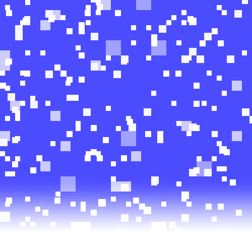

  
# All my Shadertoy shaders!
#### Shadertoy profile with all my shaders > [shadertoy.com/user/jumagfx](https://www.shadertoy.com/user/jumagfx)
#### Press the link or top right redirect icon to see each shader on Shadertoy with good quality!
#### Some of these shaders are not on shadertoy & are made in engine (if the word engine is next to the title then its made in engine)!

[Rainbow Cubes](https://www.shadertoy.com/view/lcsGDB) | [Kings Reflection](https://www.shadertoy.com/view/lflGD2)
:-------------------------:|:-------------------------:
   |  
[Never Seen Snow](https://www.shadertoy.com/view/MXBXDG) | [Kings Reflection Debug](https://www.shadertoy.com/view/lflGD2)
 | 
WIP1 | WIP2
IMG1 | IMG2

---

# Noise & Hashing shaders

[Vornoi]() | [Fractional Brownian Motion]() | [Value]()
:---:|:---:|:---:
A | B | C

---

***Tools used below to showcase GIFs***   
Shadertoy Exporter: https://github.com/KoltesDigital/shadertoy-exporter   
GIF Compressor/Optimizer: https://ezgif.com/optimize  

***Notes***  
Format is "Length x Width @ fps & seconds - compression number"
ex. 500 x 500 @ 20 & 9s - 35% 

  
GIFs Properties

  
Rainbow Cubes: 400 x 400 @ 20fps & 9s - 35%  
Kings Reflection: 400 x 400 @ 25fps & 5s -35%  
Never Seen Snow: 500 x 500 @ 28fps & 5s - no compression  
  

# Math Notation Fun & Notes
The main purpose of this is for me to learn math notation, so why not combine what I do with shader code and math? Shader code is kinda 99% or 100% even just mathematics!... and colors of course :), I will also include links to the [mathsisfun](https://www.mathsisfun.com) website since IMO they are the best resource for understanding math since they show it in a manner that is extremely simple to understand which is very important when learning new & difficult topics! Especially later on in life when you start reading research pappers and they are all just filled with letters, better start now than never!

  
SUMMATION / SIGMA  
[MathsIsFun Sigma](https://www.mathsisfun.com/algebra/sigma-notation.html)

$$\LARGE\sum_{i=1}^{n} {i}$$
- n represents the max iterations
- i = 1 represents the starting index
- i on the right represents what is being summed

Example below: Start at index i being 1 and iterate to the maximum of 4 times, and sum all i's
$$\LARGE\sum_{i=1}^{4} {i}$$
$$\LARGE\sum_{i=1}^{4} {i} = 1 + 2 + 3 + 4 = 10$$
$$\LARGE\sum_{i=1}^{4} {i} = 10$$
Answer is 10!

