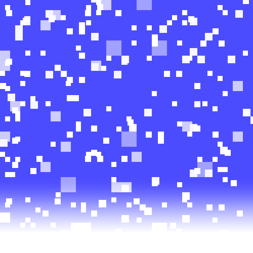
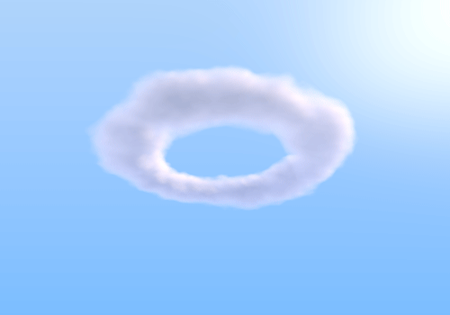

  
# All my Shadertoy shaders!
#### Shadertoy profile with all my shaders > [shadertoy.com/user/jumagfx](https://www.shadertoy.com/user/jumagfx)
#### Press the link or top right redirect icon to see each shader on Shadertoy with good quality!
#### Some of these shaders are not on shadertoy & are made in engine (if the word engine is next to the title then its made in engine)!

[Rainbow Cubes](https://www.shadertoy.com/view/lcsGDB) | [Kings Reflection](https://www.shadertoy.com/view/lflGD2)
:-------------------------:|:-------------------------:
   |  
[Never Seen Snow](https://www.shadertoy.com/view/MXBXDG) | [Kings Reflection Debug](https://www.shadertoy.com/view/lflGD2)
 | 
[Fake Blue Cave](https://www.shadertoy.com/view/WfdGRB) | [Hopium Clouds](https://www.shadertoy.com/view/wXdXRn)
 | 
X | X
Soon... | Soon...

---

# Noise & Hashing shaders

[Vornoi]() | [Fractional Brownian Motion]() | [Value]()
:---:|:---:|:---:
A | B | C

---

***Tools used below to showcase GIFs***   
Shadertoy Exporter: https://github.com/KoltesDigital/shadertoy-exporter   
GIF Compressor/Optimizer: https://ezgif.com/optimize  

***Notes***  
Format is "Length x Width @ fps & seconds - compression number"
ex. 500 x 500 @ 20 & 9s - 35% 

  
GIFs Properties

  
Rainbow Cubes: 400 x 400 @ 20fps & 9s - 35%  
Kings Reflection: 400 x 400 @ 25fps & 5s -35%  
Never Seen Snow: 500 x 500 @ 28fps & 5s - no compression  
Fake Blue Cave: 400 x 400 @ 24fps & 8s (+3s start) - no compression  
Hopium Clouds: 500 x 350 @ 25fps & 12s (0s start) - no compression  
  

